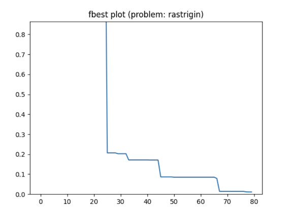

# FLW Algorithm
This is a Python implementation of the FLW (Follow-the-Leader + Walkers) algorithm, a multi-agent search algorithm for optimising bound-constrained cost functions.


The search strategy of the FLW algorithm is based on follow-the-leader intensification and random walk diversification rules. The algorithm is suitable for optimisation problems with continuous (real-valued) variables, and has been shown to perform effectively on a variety of benchmark problems.

This repository consists of a module with a Python class implementation of the optimiser (`FLW_Real` class), along with a module defining a collection of benchmark optimisation problems, and a test script showcasing different examples of how to solve these problems with the FLW algorithm.

# Usage

To use the FLW algorithm, you can import the `FLW_Real` class from the `flw_class.py` module:

```python
from flw_class import FLW_Real
from flw_bm import * 

# Create an instance of FLW_Real with the problem function as argument (use any from the 'flw_bm.py' module)
flw = FLW_Real(fcost=my_problem_function)

# Optimise the problem
flw.optimise()

# Print the summary of the optimisation results
flw.summary()
```
# Examples

The `flw_test(test_case:str)` function from the `flw_test.py` script can be used to demonstrate how to use the FLW algorithm in different test cases. Here are some examples:

```python
from flw_test import flw_test

# Run experiments on a collection of different 2D benchmark problems, and display summary of each run.
flw_test("2D")

# Run experiments on a collection of benchmark problems in higher dimensions (10D), and display summary of each run.
flw_test("HD")

# Run an experiment on a specific problem from the 'flw_bm.py' script, visualize the search process with a scatter 
# plot, and at the end of the run display a summary and show a plot of the best solution per iteration.
flw_test("rastrigin")
```

Below is the output of a particular run of the last example:


```
------------------------------ RESULTS ------------------------------
Problem: rastrigin (d=2)
Ellapsed time: 1.84s                
Best cost: 0.00000000163369762163 
Found after: 5880 evaluations 
----------------------------------------------------------------------
Best solution (genotype):  [0.0, 0.0]
Best solution (phenotype): [2.20728433e-06 1.83373235e-06]
----------------------------------------------------------------------
```



# Contributing

Contributions to this project are welcome! If you find a bug or have an idea for a new feature, please open an issue on GitHub or submit a pull request.

# License

This project is licensed under the GPLv3 License - see the LICENSE file for details.

# Customisation

The `FLW_Real` class has several parameters that you can adjust to customise the optimisation process. See the docstrings in `flw_class.py` for more information, e.g.:

```
 |      Parameters
 |      ----------
 |      fcost : callable, optional
 |          Cost function to be optimized. The function should take a numpy array of 
 |          shape (n,d) as input, where n is the number of agents and d is the 
 |          dimension of the search space. The function should return an array of 
 |          shape (n,) with the corresponding cost values. See the companion file 
 |          'flw_bm.py' for a benchmark of function costs. Default is the 'sphere'
 |          cost funnction.
 |      d : int, optional
 |          Dimension of the search space. Default is 2 dimensions.
 |      LB : numpy.ndarray, optional
 |          Array of shape (d,) with the lower bounds of the search space.
 |      UB : numpy.ndarray, optional
 |          Array of shape (d,) with the upper bounds of the search space.
 |      n : int, optional
 |          Number of agents in the population.
 |      nw : float, optional
 |          Percentage of agents to be walkers.
 |      max_evals : int, optional
 |          Maximum number of function evaluations allowed.
 |      resets : int, optional
 |          Number of times the population is reset to new initial positions.
 |      setup : str, optional
 |          Method used to sample the initial positions of the agents within
 |          the search space. 
 |          Possible values are 'latin_hypercube' and 'uniform'.
 |      sampler : str, optional
 |          Method used to sample the width parameter (sigma) of walkers' steps. 
 |          Possible values are 'adaptive' and 'uniform'.   
 |      elite : str, optional
 |          Determines which group of agents is passed on as elite to the next 
 |          iteration, maintaining the global best solution discovered so far. 
 |          Possible values are:
 |          - 'any': Any individual (a walker) is selected as elite.
 |          - 'walkers': All the walkers are selected as elite.
 |          - 'everyone': All the agents are selected as elite.   
 |      operators : str, optional
 |          A string of character flags representing which search operators will 
 |          be used to optimise the cost function. Any combination of the characters
 |          'F', 'W', 'E', and 'R' is valid, each character representing the 
 |          following operator:
 |          - 'F': Follow-the-leader intensification operator
 |          - 'W': Random walk diversification operator
 |          - 'E': Elitism operator, according to the defined 'elite' strategy
 |          - 'R': Reset operator, according to the 'resets' parameter.
 |          For example, operators='FWER' indicates that the algorithm will apply 
 |          all the search operators, while operators='REW' will apply only reset, 
 |          elitism, and walk operators.   
 |      viz : bool, optional
 |          If True, visualize the optimization process using a scatter plot.
 |          Only valid for 2D problems (d=2). Default is False.
 |      hist : bool, optional
 |          If True, store history of best, average and worst solutions found during
 |          the optimization process. Default is False.
 |      
 |      Returns
 |      -------
 |      None
```
